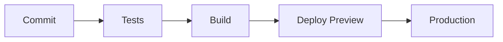

# ProfileCoder - Twoje DNA Zawodowe

<p align="center">
  
  
  
  = 18"/>
</p>

## 🚀 O Projekcie

**ProfileCoder** to innowacyjne narzędzie do tworzenia i kodowania spersonalizowanych profili zawodowych. Dzięki intuicyjnemu interfejsowi możesz precyzyjnie określić swoje preferencje dotyczące środowiska pracy, stylu komunikacji, zarządzania czasem i wielu innych aspektów życia zawodowego.

Efektem jest unikalny kod - Twoje "DNA Zawodowe" - który w zwięzłej formie przedstawia Twój idealny profil pracy. Ten kod można łatwo udostępniać, analizować lub przechowywać w systemach HR.


## 🔍 Kluczowe Funkcje

- **Interaktywny kreator profilu** - intuicyjny interfejs z kategoryzowanymi opcjami
- **Generowanie kodu DNA Zawodowego** - np. `❤️{🎯WP💰;🛡️WE✅}▪📊{📊WS⚡;⏱️WH40}`
- **Zarządzanie segmentami** - możliwość dostosowania dostępnych kategorii i opcji
- **Kopiowanie do schowka** - szybkie udostępnianie wygenerowanego kodu
- **Responsywny design** - działa na urządzeniach mobilnych i desktopowych
- **Estetyczny interfejs** - inspirowany terminalem, z nowoczesnym twistem

## 🔮 Przykładowe Kody DNA

Poniżej znajdują się przykłady kodów DNA dla różnych profili zawodowych:

### 👨‍💻 Developer zorientowany na finanse z elastycznym czasem pracy

```
❤️{🎯WP💰;🛡️WE✅}▪📊{📊WS⚡;⏱️WH40}▪💼{🏢WLA;💯WC⭐}
```

**Dekodowanie:**
- ❤️ Wartości Zawodowe:
  - 🎯WP💰: Cel Pracy - Finansowy
  - 🛡️WE✅: Etyka Pracy - Uczciwość
- 📊 Ścieżka Zawodowa:
  - 📊WS⚡: Styl Pracy - Intensywny
  - ⏱️WH40: Godziny Pracy - 40h tygodniowo
- 💼 Środowisko Pracy:
  - 🏢WLA: Lokalizacja - Dowolna
  - 💯WC⭐: Kultura - Zorientowana na Wyniki

### 👩‍🎤 Manager kreatywny zorientowany na zespół

```
❤️{🎯WP🌍;🛡️WE🤝}▪👥{👥TS🙌;💬CS🙋}▪📊{📊WS💡;⏱️WH30}
```

**Dekodowanie:**
- ❤️ Wartości Zawodowe:
  - 🎯WP🌍: Cel Pracy - Wpływ Społeczny
  - 🛡️WE🤝: Etyka Pracy - Współpraca
- 👥 Zespół:
  - 👥TS🙌: Rozmiar Zespołu - Mały
  - 💬CS🙋: Styl Komunikacji - Bezpośredni
- 📊 Ścieżka Zawodowa:
  - 📊WS💡: Styl Pracy - Kreatywny
  - ⏱️WH30: Godziny Pracy - 30h tygodniowo

### 👩‍⚕️ Specjalista z branży medycznej zorientowany na strukturę

```
❤️{🎯WP❤️;🛡️WE📖}▪📊{📊WS📊;⏱️WH45}▪👥{👥TSM;💬CS📝}
```

**Dekodowanie:**
- ❤️ Wartości Zawodowe:
  - 🎯WP❤️: Cel Pracy - Pasja
  - 🛡️WE📖: Etyka Pracy - Standardy
- 📊 Ścieżka Zawodowa:
  - 📊WS📊: Styl Pracy - Zorganizowany
  - ⏱️WH45: Godziny Pracy - 45h tygodniowo
- 👥 Zespół:
  - 👥TSM: Rozmiar Zespołu - Średni
  - 💬CS📝: Styl Komunikacji - Formalny

## 💡 Zastosowania

ProfileCoder znajduje zastosowanie w wielu obszarach związanych z pracą i zarządzaniem:

### 🔹 Rekrutacja i HR
- Precyzyjne dopasowanie kandydatów do kultury organizacyjnej firmy
- Definiowanie oczekiwań dotyczących stylu pracy dla konkretnych stanowisk
- Tworzenie spójnych ogłoszeń o pracę uwzględniających wszystkie aspekty stanowiska

### 🔹 Onboarding pracowników
- Lepsze zrozumienie preferencji nowych pracowników
- Dostosowanie środowiska pracy do indywidualnych potrzeb
- Ułatwienie integracji z zespołem przez identyfikację potencjalnych różnic w stylu pracy

### 🔹 Zarządzanie zespołem
- Mapowanie stylów pracy członków zespołu
- Identyfikacja potencjalnych konfliktów wynikających z różnych preferencji
- Optymalizacja współpracy i podziału zadań w oparciu o profile

### 🔹 Rozwój osobisty i planowanie kariery
- Identyfikacja własnych preferencji zawodowych
- Porównanie aktualnego środowiska pracy z preferowanym
- Ukierunkowanie poszukiwań nowej pracy na firmy o odpowiedniej kulturze

### 🔹 Badania i analizy rynku pracy
- Zbieranie anonimowych danych o preferencjach zawodowych
- Analiza trendów na rynku pracy w różnych branżach
- Badanie zależności między stylem pracy a produktywnością

## 🛠️ Architektura Techniczna

### Stack Technologiczny

#### Core
- **React 18.3** z TypeScript 5.5
- **Vite 5.4** - build tool i dev server
- **TanStack Query 5** - zarządzanie stanem i cache

#### UI i Stylowanie
- **Shadcn UI** - system komponentów
- **Radix UI** - dostępne komponenty bazowe
- **Tailwind CSS 3.4** - utility-first CSS
- **Tailwind Animate** - animacje
- **Lucide React** - system ikon

#### Formularze i Walidacja
- **React Hook Form 7** - zarządzanie formularzami
- **Zod** - walidacja schematów
- **@hookform/resolvers** - integracja z Zod

#### Routing i Nawigacja
- **React Router 6** - client-side routing

### Konwencje Kodowania

#### Komponenty React
```typescript
// Przykład komponentu
export function ProfileSegment({ config, onChange }: ProfileSegmentProps) {
  if (!config) return null
  
  return (
    <div className="space-y-4">
      {/* komponenty */}
    </div>
  )
}
```

#### TypeScript
```typescript
// Przykład interfejsu
interface ProfileSegmentProps {
  config: SegmentConfig
  onChange: (value: string) => void
}

// Zamiast enum używamy const map
const SEGMENT_TYPES = {
  WORK_STYLE: 'work_style',
  COMMUNICATION: 'communication'
} as const
```

### Architektura Aplikacji

```
src/
├── components/     # Komponenty React
│   └── ui/        # Komponenty bazowe (Shadcn)
├── data/          # Dane statyczne i konfiguracja
│   ├── segments/  # Definicje segmentów profilu
│   └── temp/      # Dane tymczasowe
├── hooks/         # Custom React hooks
├── lib/           # Utilities i helpers
├── pages/         # Komponenty stron
└── styles/        # Style globalne i motywy
```

### Konwencje i Best Practices

#### Komponenty
- Używamy funkcyjnych komponentów
- Preferujemy named exports
- Implementujemy early returns
- Stosujemy TypeScript dla wszystkich komponentów

#### Stylowanie
- Mobile-first approach z Tailwind CSS
- Używamy Shadcn UI jako bazy komponentów
- Implementujemy dark mode
- Przestrzegamy zasad dostępności WCAG

#### State Management
- Minimalizujemy użycie lokalnego stanu
- Używamy TanStack Query do cache'owania
- Implementujemy optymistyczne aktualizacje

#### Wydajność
- Lazy loading dla komponentów stron
- Optymalizacja obrazów przez Vite
- Memoizacja ciężkich komponentów
- Code splitting na poziomie routingu

### Development Workflow

#### Git Flow
- `main` - branch produkcyjny
- `develop` - branch deweloperski
- `feature/*` - nowe funkcjonalności
- `fix/*` - poprawki błędów

#### Code Quality
- ESLint z konfiguracją TypeScript
- Prettier dla spójnego formatowania
- Husky dla git hooks
- Conventional Commits

#### Testing
- Unit testy z Vitest
- Testy komponentów z React Testing Library
- E2E testy z Playwright
- Testy dostępności z axe-core

### Optymalizacja i Monitoring

#### Performance
- Code splitting (React.lazy)
- Tree shaking przez Vite
- Memoizacja heavy components
- Optymalizacja obrazów
- Prefetching kluczowych zasobów

#### Error Handling
- Error boundaries dla komponentów
- Centralne logowanie błędów
- Toast notifications dla UX
- Fallback UI components

### Security & Deployment

#### Bezpieczeństwo
- Strict CSP headers
- CSRF protection
- Rate limiting
- Input sanitization przez Zod
- Security headers przez Helmet

#### CI/CD Pipeline


#### Deployment Checklist
- [ ] Wszystkie testy przechodzą
- [ ] Build produkcyjny jest stabilny
- [ ] Audyt bezpieczeństwa npm
- [ ] Lighthouse score > 90
- [ ] Aktualizacja dokumentacji

## 🚀 Rozwój Lokalny

### Wymagania
- Node.js >= 18
- npm >= 9

### Instalacja

```bash
# Klonowanie repozytorium
git clone https://github.com/twoj-username/ProfileCoder.git

# Instalacja zależności
npm install
```

### Dostępne Skrypty

```bash
# Development server (http://localhost:5173)
npm run dev

# Build produkcyjny
npm run build

# Build deweloperski
npm run build:dev

# Linting
npm run lint

# Preview buildu
npm run preview
```

### Środowiska

```env
# .env.development
VITE_API_URL=http://localhost:3000
VITE_DEBUG=true

# .env.production
VITE_API_URL=https://api.profilecoder.com
VITE_DEBUG=false
```

## 📝 Przewodnik Rozwoju Aplikacji

### Dodawanie Nowych Segmentów

#### 1. Definicja Segmentu
```typescript
// src/data/segments/communication-style.ts
import { SegmentConfig } from '@/types/segments'

export const communicationStyleConfig: SegmentConfig = {
  id: 'communication-style',
  name: 'Styl Komunikacji',
  icon: '💬',
  options: [
    {
      id: 'formal',
      label: 'Formalny',
      value: 'F',
      description: 'Preferuje formalne kanały komunikacji'
    },
    // ... więcej opcji
  ]
}
```

#### 2. Rejestracja Segmentu
```typescript
// src/data/segments/index.ts
import { communicationStyleConfig } from './communication-style'

export const segments = {
  communicationStyle: communicationStyleConfig,
  // ... inne segmenty
}
```

#### 3. Dodanie Typów
```typescript
// src/types/segments.ts
export interface SegmentOption {
  id: string
  label: string
  value: string
  description?: string
}

export interface SegmentConfig {
  id: string
  name: string
  icon: string
  options: SegmentOption[]
}
```

### Tworzenie Nowych Obszarów

#### 1. Struktura Katalogów
```bash
src/features/new-area/
├── components/     # Komponenty specyficzne dla obszaru
├── hooks/         # Custom hooks
├── types/         # TypeScript types
├── utils/         # Funkcje pomocnicze
└── index.ts       # Public API obszaru
```

#### 2. Implementacja Komponentów
```typescript
// src/features/new-area/components/AreaView.tsx
export function AreaView({ config }: AreaViewProps) {
  return (
    <section className="space-y-4">
      <h2 className="text-2xl font-bold">{config.name}</h2>
      {/* Komponenty obszaru */}
    </section>
  )
}
```

#### 3. Integracja z Routingiem
```typescript
// src/pages/new-area.tsx
import { AreaView } from '@/features/new-area'

export default function NewAreaPage() {
  return <AreaView config={areaConfig} />
}
```

### Rozszerzanie Funkcjonalności

#### 1. Dodawanie Nowych Hooków
```typescript
// src/hooks/useSegmentValue.ts
export function useSegmentValue(segmentId: string) {
  const queryClient = useQueryClient()
  
  return useMutation({
    mutationFn: updateSegmentValue,
    onSuccess: () => {
      queryClient.invalidateQueries({ queryKey: ['segments'] })
    }
  })
}
```

#### 2. Implementacja Nowych Feature Flags
```typescript
// src/config/features.ts
export const FEATURES = {
  NEW_SEGMENT_UI: process.env.VITE_ENABLE_NEW_SEGMENT_UI === 'true',
  BETA_FEATURES: process.env.VITE_ENABLE_BETA === 'true'
}
```

#### 3. Dodawanie Nowych Motywów
```typescript
// src/styles/themes/custom-theme.ts
export const customTheme = {
  colors: {
    primary: {
      50: '#f0f9ff',
      // ... więcej odcieni
    }
  },
  // ... inne właściwości motywu
}
```

### Best Practices

#### Organizacja Kodu
- Każdy nowy obszar w osobnym katalogu w `features/`
- Wspólne komponenty w `components/shared/`
- Typy i interfejsy w `types/`
- Logika biznesowa w `features/`

#### Nazewnictwo
- Komponenty: PascalCase (np. `SegmentSelector.tsx`)
- Hooki: camelCase z prefix 'use' (np. `useSegmentValue.ts`)
- Utilities: camelCase (np. `formatSegmentValue.ts`)

#### Testowanie
```typescript
// src/features/new-area/__tests__/AreaView.test.tsx
import { render, screen } from '@testing-library/react'

describe('AreaView', () => {
  it('renders area name correctly', () => {
    render(<AreaView config={mockConfig} />)
    expect(screen.getByText(mockConfig.name)).toBeInTheDocument()
  })
})
```

## ☕ Wsparcie Projektu

<p align="center">
  <a href="https://buycoffee.to/mat" target="_blank">
    
  </a>
</p>

ProfileCoder jest projektem open-source, rozwijany z pasją przez społeczność. Twoje wsparcie pomaga nam:

- 🚀 Rozwijać nowe funkcjonalności
- 🛠️ Utrzymywać infrastrukturę
- 📚 Tworzyć dokumentację
- 🐛 Naprawiać błędy
- 🌐 Budować społeczność wokół projektu

Jeśli korzystasz z ProfileCoder i chcesz wesprzeć jego dalszy rozwój, rozważ [kupienie kawy dla twórcy](https://buycoffee.to/mat). Każde wsparcie, nawet najmniejsze, ma ogromne znaczenie i motywuje do dalszego rozwijania narzędzia, które pomaga kodować DNA zawodowe.

*"Kod DNA wypełniony jest kawą, pasją i wsparciem społeczności."*

### System Generowania Kodu DNA

#### 1. Struktura Kodu DNA
```typescript
// src/types/dna-code.ts
export interface DNASegment {
  category: string     // np. '💼' (praca)
  value: string       // np. 'O3·C3'
  separator: string   // np. '|'
}

export interface DNACode {
  segments: DNASegment[]
  version: string
}
```

#### 2. Implementacja Generatora
```typescript
// src/lib/dna-generator.ts
export function generateDNACode(selections: ProfileSelections): DNACode {
  return {
    segments: Object.entries(selections).map(([category, value]) => ({
      category: getCategoryEmoji(category),
      value: formatSegmentValue(category, value),
      separator: ' | '
    })),
    version: '1.0'
  }
}

// Przykład użycia:
// 💼 O3·C3 | 👥 S·D·4 | ⏱️ 40h·9-17·⚡
```

#### 3. Dodawanie Nowych Segmentów do DNA

1. Zdefiniuj format segmentu w `src/config/dna-formats.ts`:
```typescript
export const DNA_FORMATS = {
  workStyle: {
    prefix: '💼',  // Emoji kategorii
    pattern: '[A-Z][0-9]', // Format wartości
    separator: '·'      // Separator wewnętrzny
  }
}
```

2. Dodaj parser w `src/lib/dna-parser.ts`:
```typescript
export function parseWorkStyleSegment(value: string): WorkStyleConfig {
  const [style, level] = value.split('·')
  return {
    style: WORK_STYLES[style],
    level: parseInt(level)
  }
}
```

3. Zarejestruj w systemie:
```typescript
// src/config/dna-registry.ts
export const DNA_SEGMENTS = {
  workStyle: {
    format: DNA_FORMATS.workStyle,
    parser: parseWorkStyleSegment,
    validator: validateWorkStyleSegment
  }
}
```

#### 4. Walidacja i Parsowanie
```typescript
// src/lib/dna-validator.ts
export function validateDNACode(code: string): ValidationResult {
  const segments = parseDNACode(code)
  
  return segments.reduce((result, segment) => {
    const validator = DNA_SEGMENTS[segment.type].validator
    return {
      ...result,
      ...validator(segment)
    }
  }, { isValid: true, errors: [] })
}
```

#### 5. Przykład Użycia w Komponencie
```typescript
// src/components/DNACodeGenerator.tsx
export function DNACodeGenerator() {
  const { data: selections } = useProfileSelections()
  const dnaCode = useMemo(() => 
    generateDNACode(selections),
    [selections]
  )

  return (
    <div className="p-4 bg-secondary rounded-lg">
      <h3 className="text-lg font-semibold">Twój Kod DNA</h3>
      <pre className="mt-2 p-2 bg-muted">
        {formatDNACode(dnaCode)}
      </pre>
      <CopyButton value={formatDNACode(dnaCode)} />
    </div>
  )
}
```

## 🔮 Przyszłość Projektu

ProfileCoder to dopiero początek. Oto co planujemy w przyszłości:

### 📊 Analityka i Porównania
- Możliwość porównywania profili między sobą
- Wizualizacje danych i wykresy pokazujące rozkład preferencji
- Rekomendacje oparte na analizie podobnych profili

### 🌐 Integracje
- Integracja z popularnymi systemami ATS i HRIS
- Eksport do różnych formatów (PDF, JSON, integracja z LinkedIn)
- API dla deweloperów chcących zintegrować ProfileCoder z własnymi aplikacjami

### 🧠 Sztuczna Inteligencja
- Rekomendacje oparte na AI dotyczące dopasowania do zespołu/organizacji
- Automatyczne generowanie opisów profilu na podstawie kodu DNA
- Predykcje dotyczące satysfakcji z pracy w określonym środowisku

### 🌍 Globalizacja
- Wsparcie dla wielu języków
- Dostosowanie do różnic kulturowych w postrzeganiu pracy
- Profile specyficzne dla różnych regionów i branż

## 🤝 Współpraca

Jesteśmy otwarci na współpracę! Jeśli masz pomysł na ulepszenie ProfileCoder lub chcesz zgłosić błąd:

1. Utwórz issue w repozytorium
2. Zaproponuj zmiany poprzez pull request
3. Skontaktuj się z nami bezpośrednio: contact@profilecoder.com

## 📜 Licencja

Ten projekt jest udostępniany na licencji MIT. Szczegóły znajdziesz w pliku LICENSE.

---

<p align="center">
  <b>ProfileCoder</b> - Odkoduj swój idealny styl pracy
</p>
